# Описание проекта

### Вариант 1

1. Консольное приложение для изучения английского путем восставновления правильного порядка слов в предложении.
2. Использованы библиотеки JACKSON, JAXB и драйвер H2, также база данных H2
3. Программа запускается из консоли командой

   >java -classpath "D:\JavaCourseProject\out\production\JavaCourseProject;D:\JavaCourseProject\lib\h2-2.1.214.jar;D:\JavaCourseProject\lib\jaxb-core-4.0.1.jar;D:\JavaCourseProject\lib\jaxb-impl-4.0.1.jar;D:\JavaCourseProject\lib\jackson-core-2.13.4.jar;D:\JavaCourseProject\lib\angus-activation-1.0.0.jar;D:\JavaCourseProject\lib\jackson-databind-2.13.4.jar;D:\JavaCourseProject\lib\jackson-annotations-2.13.4.jar;D:\JavaCourseProject\lib\jakarta.xml.bind-api-4.0.0.jar;D:\JavaCourseProject\lib\jakarta.activation-api-2.1.0.jar" ru.croc.LearnIT

   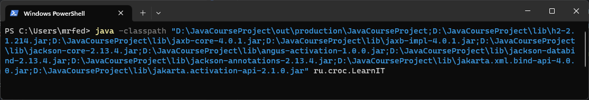

4. Пример исользвания программы
   + Пример входа через администратора
      - Вход за администратора
      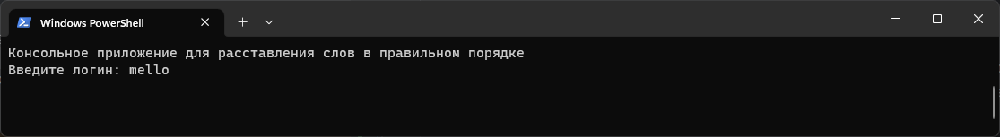
      - Пункт **меню**
      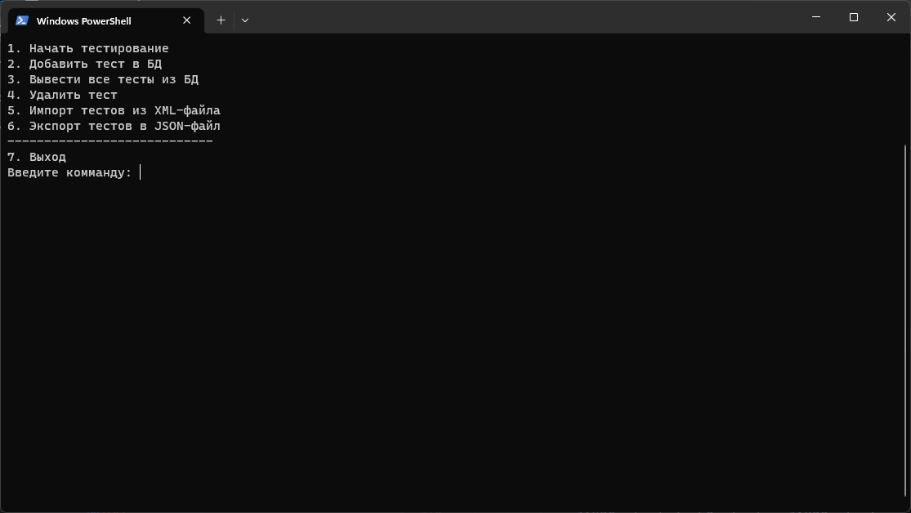
      - Пункт **начать тестирование**
      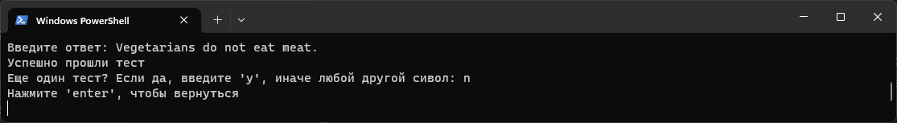
      - Пункт **добавить тест в БД**
      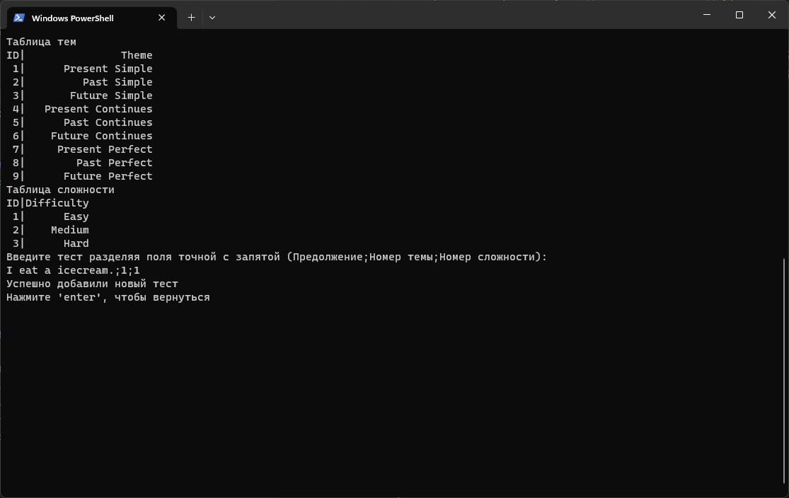
      - Пункт **вывести все тесты из БД**
      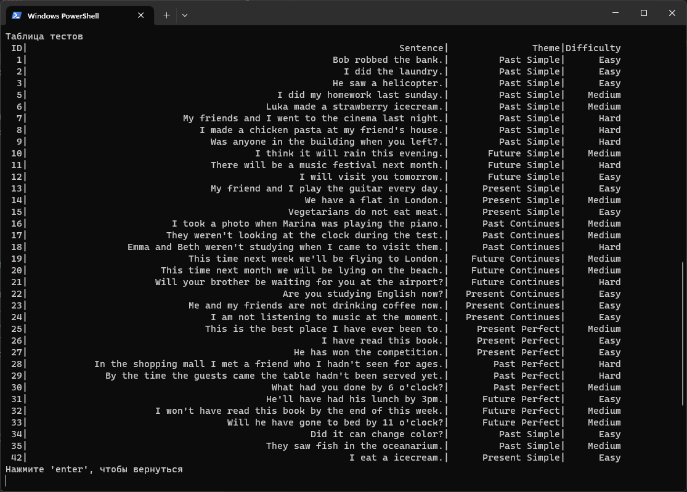
      - Пункт **удалить тест**
      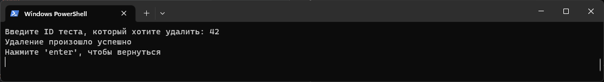
      - Пункт **ипорт тестов из XML-файла**
      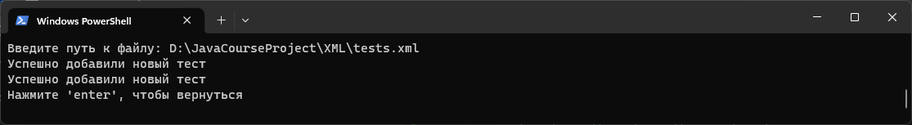
      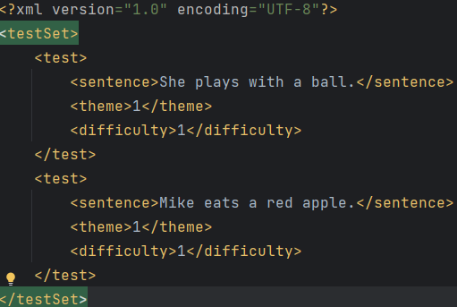
      - Пункт **экспорт тестов в JSON-файл**
      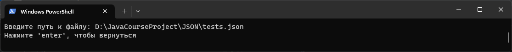
      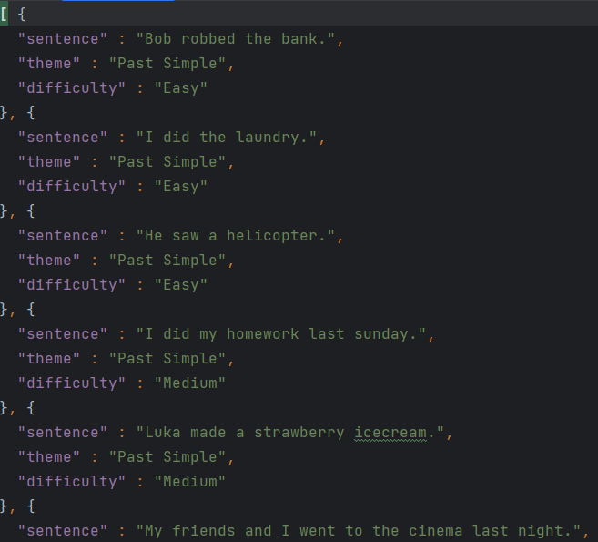
   + Пример входа через пользователя
      - Вход за администратора
      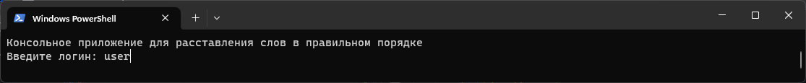
      - Пункт **меню**
      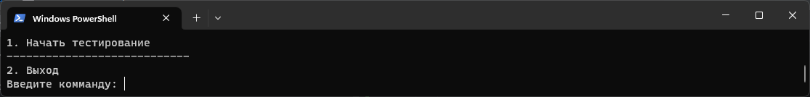
      - Пункт **начать тестирование**
      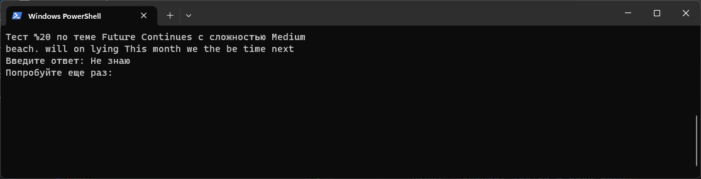